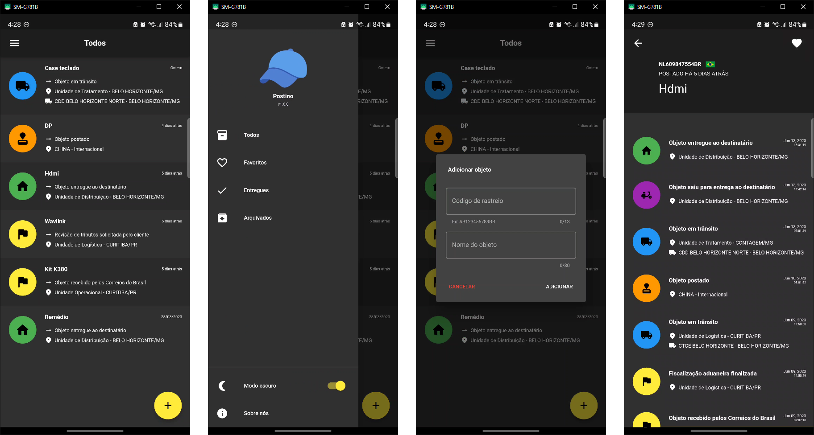

# Postino

Postino é um aplicativo desenvolvido para facilitar o rastreamento de encomendas utilizando o código postal. Com o Postino, os usuários podem inserir o código postal de uma encomenda e verificar seu status atual, bem como a última atualização e a localização, utilizando a API dos Correios.

O aplicativo também oferece recursos adicionais, como a possibilidade de arquivar objetos cadastrados, excluir encomendas antigas e favoritar aquelas mais importantes. Além disso, o Postino conta com um elegante modo claro e escuro para atender às preferências de cada usuário.

## Índice

- [Índice](#índice)
- [Demonstração](#demonstração)
- [Funcionalidades](#funcionalidades)
- [Instalação](#instalação)
- [Uso](#uso)
- [Dependências Utilizadas](#dependências-utilizadas)
- [Créditos](#créditos)

## Demonstração

## Funcionalidades

- Consulta do status de encomendas utilizando o código postal.
- Visualização da última atualização e localização da encomenda.
- Arquivamento de objetos cadastrados.
- Exclusão de objetos cadastrados.
- Favoritar objetos para acesso rápido.
- Modo claro e escuro

## Instalação

1. Clone o repositório do Postino.
2. No terminal, navegue até a pasta do projeto.
3. Execute o comando `flutter pub get` para obter as dependências.
4. Execute o aplicativo com o comando `flutter run`.

## Uso

1. Abra o aplicativo Postino.
2. Clique no botão "+" para adicionar um novo objeto.
3. Insira o código postal da encomenda no campo apropriado e um nome para identificação.
4. Toque sobre o item para verificar o status da encomenda e seus respectivos detalhes.
5. O status atual e a última atualização serão exibidos na tela, junto com a localização e data, se disponível.
6. Para arquivar um objeto cadastrado, araste o item da esquerda para a direita.
7. Para excluir um objeto cadastrado, araste o item da direita para a esquerda.
8. Para favoritar um objeto, entre na pagina de detalhes e aperte no icone de coração.

## Dependências Utilizadas

- cupertino_icons: ^1.0.2
- sqflite: ^2.2.6
- path: ^1.8.2
- sqflite_common_ffi: ^2.2.5
- shared_preferences: ^2.1.2
- http: ^1.0.0
- internet_connection_checker: ^1.0.0+1
- intl: ^0.18.1
- provider: ^6.0.5

## Créditos

Agradecemos aos seguintes integrantes do grupo pelo desenvolvimento deste projeto:

- [Felipe Augusto Morais](https://github.com/Felipefams) - DBA
- [Ricardo Henrique G. Furiati](https://github.com/RickFuriati) - Front-End
- [Pedro Lopes Costa](https://github.com/httpspedroh) - Back-End e QA
- [Victor Lopes A Araujo](https://github.com/vlopinhos) - Front-End e QA